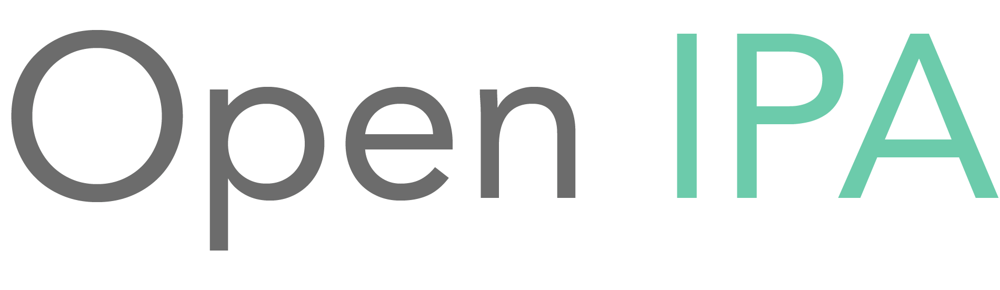

<a href="https://www.openipa.org">

  

  

</a>

# What is Open IPA?

Open IPA is a free, fast, community-focused transcription tool to transcribe Latin and French texts in into IPA (International Phonetic Alphabet). OpenIPA transcribes text in real-time, and provides in-depth transcription feedback for each letter or group of letters transcribed. Open IPA is meant primarily for Lyric Diction and to aid in song preparation for classical voice. In addition to Latin and French, we are planning to support Italian and German text in the future.

  

  
# Features
- Free: the Open IPA editor is available to everyone without the need to pay or sign up for an account
- Fast: all transcriptions happen in front of you in real-time
- Comprehensive: in addition to getting a transcription, Open IPA provides you with the methodology behind your transcription
- Responsive: Open IPA is designed for all devices, with experiences tailored for both desktop and mobile

# Getting Started

Getting started with Open IPA is easy. Simply head on over to www.openipa.org, pick the language your text is in, and type or paste it in the field provided. Open IPA will transcribe the text for you, which you are free to copy or export to a PDF using the buttons at the bottom of the editor. If you would like to know more about how your text was transcribed, simply hover over the outputted text (original or IPA) to see an in-depth analysis of how each letter, syllable, and word was transcribed.

# Requirements

All you need to use Open IPA is a web browser and a song to transcribe!

# FAQ

### How accurate is Open IPA?

While we strive to have our transcription algorithm be as accurate as possible, there are bound to be errors eventually. We are actively working to improve our database of exceptions, but some exception words may not be included at this time. In addition, certain transcription rules that revolve around more than just the letters themselves (e.g. part of speech) are still a work in progress. If your transcription does not seem correct, we encourage you to use the transcription feedback you get from Open IPA to your advantage – it can help determine where the issue may lie, and help you to track down the correct transcription.

### How can I get involved?

As Open IPA is open-source, contributions are welcome. In addition, if you have any comments, questions, or feedback you are welcome to join us over at [r/openipa](https://www.reddit.com/r/openipa/). We hope to see you there!

### I don't know much about IPA Transcription. How can I try it out?

#### Try using this French text from Massenet's _Vision Fugitive_:

Ce breuvage pourrait me donner un tel rêve!  
Je pourrais la revoir... 
Comtempler sa beauté! 
Divine volupté à mes regards promise! 
Espérance trop brève 
Qui viens bercer mon coeur 
et troubler ma raison... 
Ah! ne t'enfuis pas douce illusion!  

Vision fugitive et toujours poursuivie 
Ange mystérieux qui prend toute ma vie... 
Ah! c'est toi! que je veux voir 
Ô mon amour! ô mon espoir! 
Vision fugitive! c'est toi! 
Qui prends toute ma vie! 
Te presser dans mes bras! 
Sentir battre ton coeur 
D'une amoureuse ardeur! 
Puis mourir enlacés... 
Dans une même ivresse... 
Pour ces transports... pour cette flamme. 
Ah! sans remords et sans plainte 
Je donnerais mon âme 
Pour toi mon amour! mon espoir! 
Vision fugitive! c'est toi! 
Qui prends toute ma vie! 
Oui! c'est toi! mon amour! 
Toi, mon seul amour! mon espoir! 

# License

Open IPA is under the GNU Affero General Public License v3.0. See the [LICENSE](https://github.com/hfellerhoff/openipa/blob/master/LICENSE) for more information.
